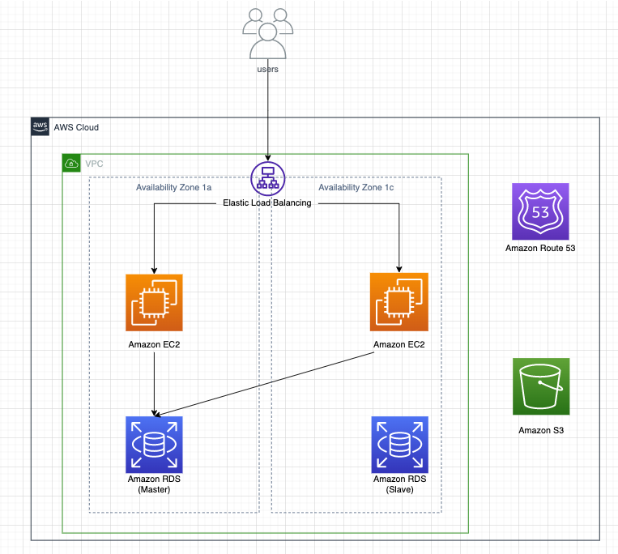
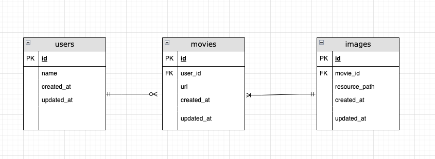

## 問題
動画配信のwebサイトのサーバーを作る。
そのとき、home画面にアクセスがくるリクエスト数が多いため、サーバーの負荷を分散させながらリクエストを処理できるシステムインフラを用いたwebサーバーのアーキテクチャ図を図式してください。

home画面に返すのは、以下のデータを返します。

・動画の投稿者名
・動画サムネイル
・動画の視聴URL

これらを返すために必要なデータモデルも設計してください。

## 回答

### アーキテクチャ図

### データモデル設計

